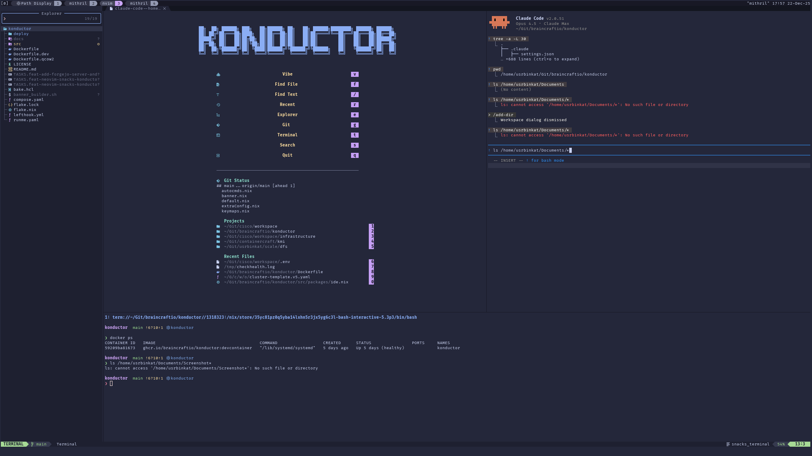
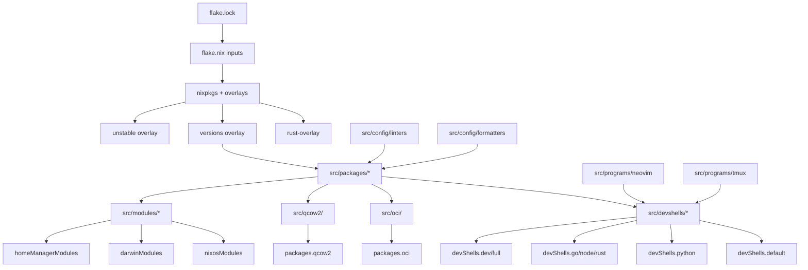

# Konductor Nix Flake

Hermetic polyglot development environments for local, container, and virtual machine deployment with
complete configuration isolation and reproducible builds.

[](https://nixos.org)
[](LICENSE)
[](https://nixos.org)
[](https://deepwiki.com/braincraftio/konductor)

---


<sup>Neovim with snacks.nvim dashboard, file explorer, and integrated tooling running in a devcontainer</sup>

---

## Overview

Konductor is a Nix flake providing reproducible, multi-target development environments for polyglot
projects. Built on the Single Source of Truth pattern, it delivers consistent tooling across
development shells, OCI containers, QCOW2 virtual machines, and system modules.

The flake architecture achieves hermetic configuration management through Nix wrapper scripts that
inject config file paths at runtime, ensuring consistent behavior across all environments without
relying on user home directories or project dotfiles.

### Key Features

- Multi-target consistency (devshells, containers, VMs, modules)
- Hermetic configuration (13 linters, 8 formatters, all Nix-managed)
- Compositional architecture (base shell + language-specific layers)
- Zero-trust dependency management (FlakeHub integration)
- Single Source of Truth for versions, configs, and packages
- Cross-platform support (Linux, macOS, NixOS, containers)
- XDG Base Directory compliance for shell configurations

### Target Audience

Konductor targets senior developers and platform engineers who value reproducibility over
convenience and architecture over ad-hoc scripting.

---

## Quick Start

### Local VM Development (Recommended)

The canonical path for Konductor development uses a local NixOS VM with your repo mounted at `/workspace`:

```bash
# Clone and symlink
gh repo clone braincraftio/konductor ~/Git/github.com/braincraftio/konductor
ln -s ~/Git/github.com/braincraftio/konductor ~/.konductor
cd ~/.konductor

# Enter devshell and deploy VM
nix develop .#konductor
runme run nix-build-qcow2-deploy

# SSH to VM (repo mounted at /workspace)
ssh localhost
cd /workspace && nix develop .#konductor
```

Inside the VM:
- `/workspace` = your host repo (9p mount, live sync)
- Full docker/qemu/libvirt available for nested builds
- Changes persist to host immediately

### Prerequisites

Konductor requires [Lix](https://lix.systems/) (a Nix variant) with flakes enabled.

```bash
# Check existing installation
nix --version
```

<details>
<summary><b>Install Lix (if not installed)</b></summary>

```bash
# Install Lix with flakes and unfree packages enabled
curl -sSf -L https://install.lix.systems/lix | sh -s -- install \
  --no-confirm \
  --extra-conf "experimental-features = nix-command flakes" \
  --extra-conf "allow-unfree = true" \
  --extra-conf "warn-dirty = false"

# Add Nix to your shell (bash - adjust for zsh/fish)
cat <<'EOF' | tee -a ~/.bashrc
if [ -e /nix/var/nix/profiles/default/etc/profile.d/nix-daemon.sh ]; then
  . /nix/var/nix/profiles/default/etc/profile.d/nix-daemon.sh
fi
EOF

# Reload shell
source ~/.bashrc
```

Verify installation:

```bash
nix --version
# Expected: nix (Lix, like Nix) 2.94.0
```

**Upgrading an existing Nix/Lix install:**

```bash
sudo --preserve-env=PATH nix run \
  --experimental-features "nix-command flakes" \
  --extra-substituters https://cache.lix.systems \
  --extra-trusted-public-keys "cache.lix.systems:aBnZUw8zA7H35Cz2RyKFVs3H4PlGTLawyY5KRbvJR8o=" \
  'git+https://git.lix.systems/lix-project/lix?ref=refs/tags/2.94.0' -- \
  upgrade-nix \
  --extra-substituters https://cache.lix.systems \
  --extra-trusted-public-keys "cache.lix.systems:aBnZUw8zA7H35Cz2RyKFVs3H4PlGTLawyY5KRbvJR8o="
```

See [Lix installation guide](https://lix.systems/install/) for NixOS, nix-darwin, and other options.

</details>

### Use Konductor via Nix Registry

Register the flake for convenient access from any directory:

```bash
# Add konductor to your nix registry (one-time setup)
nix registry add konductor github:braincraftio/konductor

# Enter full polyglot environment from anywhere
nix develop konductor#full
```

### Use Konductor from Local Clone

Clone and run from the local directory:

```bash
git clone https://github.com/braincraftio/konductor.git
nix develop ./konductor#full
```

### Development Shells

```bash
# Full polyglot environment (all languages + IDE)
nix develop konductor#full

# Language-specific shells
nix develop konductor#python   # Python 3.12 + uv + ruff + mypy
nix develop konductor#go       # Go 1.24 + gopls + delve
nix develop konductor#node     # Node.js 22 + pnpm + biome
nix develop konductor#rust     # Rust 1.82.0 + cargo + clippy

# IDE-only shell (Neovim + Tmux + LazyGit)
nix develop konductor#dev

# Default shell (core tools, no language runtimes)
nix develop konductor
```

### Optional: Task Automation with Mise

For contributors and users who prefer task automation, Konductor provides mise tasks for development
workflows.

<details>
<summary><b>Install Mise (if not installed)</b></summary>

```bash
# Install mise
curl https://mise.run | sh

# Add mise to your shell (bash)
echo 'eval "$(~/.local/bin/mise activate bash)"' >> ~/.bashrc

# For zsh users
echo 'eval "$(~/.local/bin/mise activate zsh)"' >> ~/.zshrc

# Reload shell
source ~/.bashrc  # or source ~/.zshrc
```

See [mise getting started](https://mise.jdx.dev/getting-started.html) for more installation options
(brew, apt, dnf, etc.).

</details>

With mise installed (from cloned repo):

```bash
cd konductor
mise run help    # Show all commands
mise run lint    # Run all linters
mise run format  # Format codebase
```

### Build Deployment Targets

```bash
# OCI container (Linux only)
nix build .#oci
docker load < result
docker run --rm -it $(cat result)

# QCOW2 VM image (Linux only)
mise run nix:qcow2
```

---

## Features

### Development Shells

Konductor provides 8 specialized shells using compositional hierarchy:

| Shell     | Command                   | Description       | Key Packages               |
| --------- | ------------------------- | ----------------- | -------------------------- |
| default   | `nix develop`             | Foundation shell  | git, jq, ripgrep, fzf      |
| python    | `nix develop .#python`    | Python 3.12 dev   | uv, ruff, mypy, bandit     |
| go        | `nix develop .#go`        | Go 1.24 dev       | gopls, delve, linter       |
| node      | `nix develop .#node`      | JavaScript/TS dev | pnpm, biome, prettier      |
| rust      | `nix develop .#rust`      | Rust 1.82.0 dev   | cargo, clippy, analyzer    |
| dev       | `nix develop .#dev`       | IDE tools         | Neovim, Tmux, LazyGit      |
| full      | `nix develop .#full`      | Everything        | All languages + IDE        |
| konductor | `nix develop .#konductor` | Self-hosting      | full + docker/qemu/libvirt |

Each shell extends the base shell using `overrideAttrs` pattern:

- Base provides: Core tools, CLI utilities, linters, formatters
- Language shells add: Runtime, LSP server, debugger, linter, formatter
- Auto-setup: Python venv activation, Go workspace creation, PATH updates

### Build Targets

#### OCI Container (nix2container)

Multi-architecture container images (amd64 + arm64) built with nix2container and Docker Buildx.

```bash
# Single architecture (native)
mise run docker:build

# Multi-architecture (amd64 + arm64)
docker buildx bake konductor --push

# Run as unprivileged user
docker run --rm -it ghcr.io/braincraftio/konductor:latest

# Run as admin user (sudo access)
docker run --rm -it -u kc2admin ghcr.io/braincraftio/konductor:latest
```

User model:

- `kc2admin` (UID 1001): Admin user with passwordless sudo (wheel group)
- `kc2` (UID 1002): Unprivileged user for CI/CD workflows

Includes: Core tools, network utilities, linters, formatters, Neovim, Tmux

Excludes: Language runtimes (use `nix develop konductor#{python,go}` inside)

#### QCOW2 VM (nixos-generators)

NixOS 25.11 virtual machine images for cloud deployment with cloud-init support for AWS, GCP, Azure,
and OpenStack provisioning.

**Quick deploy (recommended):**

```bash
# Ensure KVM access (one-time setup)
sudo usermod -aG kvm $USER && newgrp kvm

# Deploy VM and SSH (from konductor devshell)
runme run nix-build-qcow2-deploy
ssh localhost
```

The devshell configures SSH automatically - no manual config needed. Your SSH key is detected
and injected via cloud-init, and `ssh localhost` just works.

<details>
<summary><b>Manual build steps</b></summary>

```bash
# Build image and create cloud-init ISO
mise run nix:qcow2
```

<details>
<summary><b>Optional: Mise task shortcuts</b></summary>

| Task                                | Alias  | Description                          |
| ----------------------------------- | ------ | ------------------------------------ |
| `mise run nix:qcow2`                | `nq`   | Build QCOW2 image + cloud-init ISO   |
| `mise run nix:qcow2:start`          | `nqs`  | Start existing VM in background      |
| `mise run nix:qcow2:stop`           | `nqx`  | Stop running VM                      |
| `mise run nix:qcow2:deploy`         | `nqd`  | Build + start VM (full rebuild)      |
| `mise run nix:qcow2:deploy:console` | `nqdc` | Build + start VM with serial console |

</details>

**Launch with serial console (interactive):**

```bash
qemu-system-x86_64 -m 4096 -smp 2 -enable-kvm \
  -drive file=result/nixos.qcow2,if=virtio,format=qcow2 \
  -drive file=/tmp/konductor-cloud-init/seed.iso,media=cdrom \
  -nic user,hostfwd=tcp::2222-:22 \
  -nographic -serial mon:stdio
```

**Launch headless (SSH access):**

```bash
qemu-system-x86_64 -m 4096 -smp 2 -enable-kvm \
  -drive file=result/nixos.qcow2,if=virtio,format=qcow2 \
  -drive file=/tmp/konductor-cloud-init/seed.iso,media=cdrom \
  -nic user,hostfwd=tcp::2222-:22 \
  -daemonize
```

**SSH Configuration:**

When using the devshell, SSH is configured automatically via hermetic config at `/tmp/konductor-ssh/config`.
Just run `ssh localhost` - no manual configuration needed.

<details>
<summary><b>Manual SSH config (for use outside devshell)</b></summary>

Add to `~/.ssh/config` for access without devshell:

```bash
cat >> ~/.ssh/config << EOF
Host konductor
    HostName localhost
    Port 2222
    User $(whoami)
    IdentityFile ~/.ssh/id_ed25519
    StrictHostKeyChecking no
    UserKnownHostsFile /dev/null
EOF
```

Then connect:

```bash
ssh konductor
```

Or connect directly:

```bash
# SSH access
ssh -p 2222 kc2@localhost
```

```bash
# SSH with sudo access
ssh -p 2222 kc2admin@localhost
```

</details>

SSH sessions automatically enter the default devshell (uses `/workspace` if mounted, otherwise
`nix develop konductor`).

**Launch with shared repo (full performance + 9p filesystem):**

```bash
qemu-system-x86_64 -machine q35,accel=kvm -m 8192 -cpu host -smp 4 \
  -drive file=result/nixos.qcow2,if=virtio,format=qcow2 \
  -drive file=/tmp/konductor-cloud-init/seed.iso,media=cdrom \
  -netdev user,id=net0,hostfwd=tcp::2222-:22 \
  -device virtio-net-pci,netdev=net0 \
  -device virtio-balloon-pci \
  -device virtio-rng-pci \
  -virtfs local,path=.,mount_tag=host,security_model=mapped-xattr \
  -nographic -serial mon:stdio
```

Inside VM, `/workspace` is auto-mounted by cloud-init. Enter the self-hosting shell:

```bash
cd /workspace && nix develop konductor#konductor
```

**Credentials (set via cloud-init):**

- Dynamic user (UID 1000) - matches your host `$USER`, SSH key auth only
- `kc2admin` / `kc2admin` (UID 1001) - admin with sudo access
- `kc2` / `kc2` (UID 1002) - unprivileged user
- SSH key auto-injected from `~/.ssh/id_ed25519.pub` or `~/.ssh/id_rsa.pub`

**Cloud-init auto-setup:**

- 9p workspace mounted at `/workspace` (when virtfs device present)
- Docker and libvirtd services started (not enabled on boot for lean startup)
- Default devshell pre-built in image for instant shell entry
- SSH sessions auto-enter devshell for interactive use

**Configuration includes:**

- NixOS 25.11 with systemd-networkd (DHCP on all interfaces)
- Cloud-init enabled for automated provisioning
- OpenSSH with password and key authentication
- QEMU guest agent for time sync, snapshots, host communication
- Virtio drivers for disk, network, balloon, RNG, and 9p

**Use cases:** KVM, libvirt, Proxmox, cloud orchestration platforms

</details>

#### System Modules

Integrate Konductor into NixOS, nix-darwin, or home-manager configurations:

```nix
# flake.nix
{
  inputs.konductor.url = "github:braincraftio/konductor";

  outputs = { self, nixpkgs, konductor, ... }: {
    # NixOS system
    nixosConfigurations.myhost = nixpkgs.lib.nixosSystem {
      modules = [
        konductor.nixosModules.default
        {
          konductor = {
            enable = true;
            enablePython = true;
            enableGo = true;
            enableNode = true;
          };
        }
      ];
    };

    # macOS system (nix-darwin)
    darwinConfigurations.mymac = darwin.lib.darwinSystem {
      modules = [
        konductor.darwinModules.default
        { konductor.enable = true; }
      ];
    };

    # Home Manager
    homeConfigurations.myuser = home-manager.lib.homeManagerConfiguration {
      modules = [
        konductor.homeManagerModules.default
        { konductor.enable = true; }
      ];
    };
  };
}
```

Module options:

- `konductor.enable`: Master switch for enabling Konductor packages
- `konductor.enablePython/Go/Node/Rust`: Language-specific toggles
- `konductor.enableAI`: Claude AI and aider for development assistance
- `konductor.enableDevOps`: Kubernetes, Pulumi, Terraform tooling

### Tooling

The flake provides comprehensive development tooling:

- Neovim IDE: 20+ plugins, 10 LSP servers, Catppuccin theme
- Tmux: Nested session support, vi-mode copy, clipboard integration
- Task automation: 100+ mise tasks across 6 domains
- Git hooks: Lefthook with 20+ parallel pre-commit checks

### Linters and Formatters

Hermetic configuration system with zero-trust config resolution:

- 13 linters: shellcheck, ruff, mypy, eslint, golangci-lint, yamllint, markdownlint, hadolint,
  htmlhint, stylelint, statix, deadnix, lychee
- 8 formatters: nixpkgs-fmt, shfmt, ruff, black, prettier, taplo, biome, gofumpt
- All tools wrapped with `/nix/store` config paths (no user override)

### Design Principles

The flake architecture follows core design principles:

- Single Source of Truth: All versions in `src/lib/versions.nix`
- Cross-platform: Linux (all outputs), macOS (devshells, modules)
- FlakeHub integration: Semantic versioning without GitHub API limits
- Bash 3.2 compatible: All shell libraries work on macOS and Linux

---

## Architecture

### System Overview



### Data Flow

```text
src/lib/versions.nix (SSOT)
    ↓
src/overlays/versions.nix (pkgs.konductor.*)
    ↓
src/packages/ (category-based composition)
    ↓
src/devshells/ (base + language overrides)
    ↓
flake.nix outputs
    ├─ devShells.{default,python,go,node,rust,dev,full}
    ├─ packages.{oci,qcow2}
    ├─ nixosModules.default
    ├─ darwinModules.default
    └─ homeManagerModules.default
```

---

## Detailed Shell Specifications

### Shell Hierarchy

All shells build on the base shell using `overrideAttrs` pattern:

```text
base (default shell)
  ├─> python (base + Python 3.12 + uv)
  ├─> go (base + Go 1.24 + workspace setup)
  ├─> node (base + Node.js 22 + pnpm)
  ├─> rust (base + Rust 1.82.0 + cargo)
  ├─> dev (base + neovim + tmux + IDE tools)
  ├─> full (base + all languages + neovim + tmux + IDE tools)
  └─> konductor (full + docker + qemu + libvirt + buildkit)
```

### Language Shell Features

#### Python Shell

Python 3.12 development environment with modern tooling:

Packages: Python 3.12, uv (ultra-fast package manager), ruff, mypy, bandit, black, isort, ipython,
pytest

Environment variables:

- `UV_SYSTEM_PYTHON=1`: Use Nix-provided Python instead of uv download
- `PYTHONDONTWRITEBYTECODE=1`: Prevent .pyc file clutter

Auto-setup: Sources `.venv/bin/activate` if present (tolerates failure)

#### Go Shell

Go 1.24 development with full toolchain:

Packages: Go 1.24, gopls (LSP), delve (debugger), golangci-lint, gofumpt

Environment variables:

- `GO111MODULE=on`: Modern Go modules enabled
- `CGO_ENABLED=1`: C interop support for packages requiring cgo
- `GOPATH=$HOME/go`: Go workspace location
- `GOBIN=$GOPATH/bin`: Go binary installation directory

Auto-setup: Creates workspace structure (`src/`, `bin/`, `pkg/`), adds `$GOBIN` to PATH

#### Node Shell

JavaScript/TypeScript development with multiple package managers:

Packages: Node.js 22, pnpm, yarn, bun, TypeScript, biome, prettier, eslint

Environment variables:

- `NODE_ENV=development`: Development mode for Node.js tools
- `PNPM_HOME=$HOME/.local/share/pnpm`: pnpm installation directory

Auto-setup: Creates pnpm home, adds to PATH for global package access

#### Rust Shell

Rust 1.82.0 development with precise version control:

Packages: Rust 1.82.0 stable (via rust-overlay), cargo, rustfmt, clippy, rust-analyzer, cargo-watch,
cargo-edit

Environment variables:

- `RUST_BACKTRACE=1`: Full stack traces on panic for debugging
- `CARGO_HOME=$HOME/.cargo`: Cargo home directory

Auto-setup: Creates cargo home, adds `$CARGO_HOME/bin` to PATH

#### Dev Shell

IDE-focused environment without language runtimes:

Packages: Neovim (nixvim with 20+ plugins, 10 LSPs), Tmux (catppuccin theme), LazyGit, Helix, htop,
bottom, bat, eza, dust, tree

Use case: Working on projects that provide their own language tooling via project-local flake or
other means

#### Full Shell

Complete polyglot environment combining all capabilities:

Includes: All language packages (Python, Go, Node, Rust) plus all IDE packages (Neovim, Tmux, tools)

Environment: All language-specific environment variables and workspace setups combined with
carefully ordered PATH management

Display: Shows all four language versions on shell entry for verification

Use case: Polyglot projects requiring multiple language runtimes simultaneously

#### Konductor Shell

Self-hosting environment for building Konductor artifacts:

Includes: Everything from full shell plus container and VM build tools (docker, docker-compose,
buildkit, skopeo, crane, qemu, libvirt, virt-manager, cdrkit, cachix)

Environment: `DOCKER_HOST` and `DOCKER_BUILDKIT=1` configured

Use case: Building OCI containers and QCOW2 images inside Konductor VM, CI/CD pipelines, konductor
development

---

## Task Runner System

Konductor uses mise for task automation with 100+ tasks across 6 domains:

| Task                 | Alias      | Description                                      |
| -------------------- | ---------- | ------------------------------------------------ |
| `help`               | `h`, `?`   | Show all commands with ASCII banner              |
| `status`             | `st`       | Environment introspection (project, Nix, shell)  |
| `doctor`             | `doc`      | Comprehensive health checks (Nix, flake, Git)    |
| `lint`               | `l`        | Run all linters (nix, bash, YAML, toml, etc.)    |
| `format`             | `f`, `fmt` | Format all files (auto-fix enabled)              |
| `format:check`       | `fc`       | Validate formatting (CI mode, no writes)         |
| `nix:update`         | -          | Update flake.lock (all inputs)                   |
| `nix:gc`             | -          | Garbage collect unreferenced store paths         |
| `nix:cache:push`     | -          | Push build outputs to Cachix (requires token)    |
| `docker:build`       | `db`       | Build OCI container (nix2container + Dockerfile) |
| `docker:buildx:bake` | -          | Multi-arch build via bake.hcl (amd64 + arm64)    |
| `setup`              | -          | First-time setup (install Nix, configure Git)    |

View all tasks:

```bash
mise run help                   # Organized by domain
mise tasks ls --extended        # Flat list with descriptions
```

Task organization files:

- `.config/mise/toml/main.toml`: Help, status, doctor, orchestration
- `.config/mise/toml/nix.toml`: Nix operations (update, gc, cache)
- `.config/mise/toml/lint.toml`: 12 language-specific linters
- `.config/mise/toml/format.toml`: 14 formatters with check modes
- `.config/mise/toml/docker.toml`: 25+ Docker build variants
- `.config/mise/toml/setup.toml`: First-time installation workflow

---

## Project Structure

```text
flake/
├── flake.nix                    # Orchestration layer
├── flake.lock                   # Pinned dependencies
├── .mise.toml                   # Task runner entry point
├── Dockerfile                   # OCI production layer
├── bake.hcl                     # Docker Buildx multi-arch
├── lefthook.yml                 # Git hooks (20+ pre-commit)
│
├── src/
│   ├── lib/
│   │   ├── versions.nix         # SSOT: Language versions
│   │   ├── users.nix            # SSOT: User/group definitions
│   │   ├── env.nix              # SSOT: Environment variables
│   │   ├── aliases.nix          # SSOT: Shell aliases
│   │   └── shell-content.nix    # Config generators
│   │
│   ├── overlays/
│   │   ├── default.nix          # Overlay aggregation
│   │   └── versions.nix         # pkgs.konductor.*
│   │
│   ├── packages/
│   │   ├── default.nix          # SSOT: Package composition
│   │   ├── core.nix             # POSIX utilities
│   │   ├── cli.nix              # Developer tools
│   │   ├── languages.nix        # Language toolchains
│   │   ├── linters.nix          # Wrapped linters
│   │   ├── formatters.nix       # Wrapped formatters
│   │   ├── ide.nix              # IDE enhancements
│   │   └── konductor.nix        # Self-hosting tools
│   │
│   ├── devshells/
│   │   ├── default.nix          # Exports all 8 shells
│   │   ├── base.nix             # Foundation shell
│   │   ├── python.nix           # base + Python
│   │   ├── go.nix               # base + Go
│   │   ├── node.nix             # base + Node
│   │   ├── rust.nix             # base + Rust
│   │   ├── dev.nix              # base + IDE
│   │   ├── full.nix             # base + all + IDE
│   │   └── konductor.nix        # full + self-hosting tools
│   │
│   ├── programs/
│   │   ├── neovim/default.nix   # nixvim config (20+ plugins)
│   │   ├── tmux/default.nix     # Wrapped tmux + theme
│   │   └── shell/bash.nix       # Bash wrapper with rlwrap
│   │
│   ├── config/
│   │   ├── linters/             # 13 linters with hermetic configs
│   │   ├── formatters/          # 4 formatters with configs
│   │   └── shell/               # bash.nix, git.nix, starship.nix
│   │
│   ├── oci/
│   │   └── default.nix          # nix2container image
│   │
│   ├── qcow2/
│   │   └── default.nix          # nixos-generators QCOW2
│   │
│   └── modules/
│       ├── common.nix           # Shared options/packages
│       ├── nixos.nix            # NixOS module adapter
│       ├── darwin.nix           # nix-darwin module adapter
│       └── home-manager.nix     # home-manager adapter
│
└── .config/
    └── mise/
        ├── lib/                 # 6 bash libraries (~2,500 lines)
        └── toml/                # 6 modular task files
```

Statistics:

- Nix Code: ~4,100 lines authored
- Mise Tasks: 100+ tasks, 1,697 lines across 6 modules
- Development Shells: 8 specialized environments
- Linters: 13 with hermetic configuration
- Formatters: 8 with consistent style rules
- Container Volumes: 14 for persistence
- LSP Servers: 10 for language support
- Neovim Plugins: 20+ via nixvim framework
- Tmux Plugins: 2 (sensible, catppuccin)

---

## Configuration

### Customizing Konductor

#### Option 1: Fork and Modify

Clone and customize the flake for project-specific requirements:

```bash
# Clone and customize
git clone https://github.com/braincraftio/konductor.git ~/.konductor
cd ~/.konductor

# Edit version lockfile
vim src/lib/versions.nix
# Change: languages.python.version = "313"

# Rebuild and test
nix develop .#python
python --version
```

#### Option 2: Use as Flake Input

Reference Konductor as a flake input and extend shells:

```nix
# your-project/flake.nix
{
  inputs.konductor.url = "github:braincraftio/konductor";

  outputs = { self, nixpkgs, konductor, ... }: {
    devShells.default = konductor.devShells.${system}.python.overrideAttrs (
      old: {
        buildInputs = old.buildInputs ++ [ pkgs.postgresql pkgs.redis ];
      }
    );
  };
}
```

### Key Customization Points

Version updates (`src/lib/versions.nix`):

```nix
languages = {
  python = { version = "313"; display = "3.13"; };  # Changes all refs
  go = { version = "1_24"; display = "1.24"; };
  # ...
};
```

Package additions (`src/packages/*.nix`):

```nix
# Add to existing category
cliPackages = [ pkgs.htop pkgs.neofetch pkgs.YOUR_TOOL ];

# Or create new category
myPackages = with pkgs; [ tool1 tool2 tool3 ];
```

Linter/formatter configs (`src/config/linters/*`, `src/config/formatters/*`):

- Each tool has its own directory with config file plus wrapper
- Modify config file directly (changes automatically applied on rebuild)
- All configs live in `/nix/store` (hermetic, version-controlled)

---

## Contributing

Contributions welcome. Konductor follows Conventional Commits specification and enforces
linting/formatting via Lefthook pre-commit hooks.

Workflow:

```bash
# Fork and clone
git clone https://github.com/YOUR_USERNAME/flake.git
cd flake

# Install git hooks
nix develop
lefthook install

# Create feature branch
git checkout -b feature/my-improvement

# Make changes, test thoroughly
nix develop .#python
mise run lint
mise run format

# Commit (hooks run automatically)
git commit -m "feat(python): add pandas to python packages"

# Push and open PR
git push origin feature/my-improvement
```

Before submitting PR:

- All shells build: `nix flake check`
- Linters pass: `mise run lint`
- Formatters pass: `mise run format:check`
- Add tests if introducing new features
- Update README.md if changing public API

Code review standards:

- Single Source of Truth preserved
- No duplicated logic across files
- Changes propagate to all relevant outputs (devshells, OCI, QCOW2, modules)
- Bash scripts remain compatible with bash 3.2 (macOS)

---

## License

MIT License - see [LICENSE](LICENSE) file for details.

---

## Additional Resources

Official Documentation:

- [Nix Flakes](https://nixos.wiki/wiki/Flakes) - Reproducible dependency management
- [nixvim](https://github.com/nix-community/nixvim) - Neovim configuration framework
- [nix2container](https://github.com/nlewo/nix2container) - Efficient OCI image builder
- [nixos-generators](https://github.com/nix-community/nixos-generators) - VM image generator

Community:

- [NixOS Discourse](https://discourse.nixos.org/)
- [r/NixOS](https://reddit.com/r/NixOS)
- [Nix Community on GitHub](https://github.com/nix-community)

Related Projects:

- [devenv](https://devenv.sh/) - Alternative developer environment framework
- [flox](https://flox.dev/) - Declarative developer environments
- [devbox](https://www.jetpack.io/devbox/) - Instant development environments

---

Built with Nix. Engineered for reproducibility.
