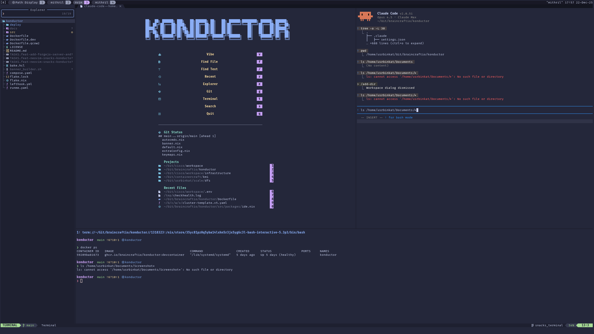
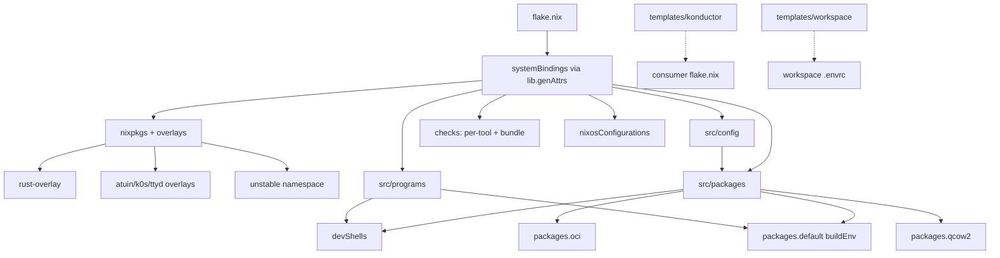

# Konductor

Hermetic polyglot development environments for local, container, and virtual machine
deployment with complete configuration isolation and reproducible builds.

[](https://nixos.org)
[](LICENSE)
[](https://nixos.org)
[](https://deepwiki.com/braincraftio/konductor)

---


<sup>Neovim with snacks.nvim dashboard, file explorer, and integrated tooling</sup>

---

## Overview

Konductor is a Nix flake providing reproducible, multi-target development environments for
polyglot projects. Built on the Single Source of Truth pattern, it delivers consistent tooling
across development shells, OCI containers, QCOW2 virtual machines, and system modules.

The flake architecture achieves hermetic configuration management through Nix wrapper scripts
that inject config file paths at runtime, ensuring consistent behavior across all environments
without relying on user home directories or project dotfiles.

### Key Capabilities

- Multi-target consistency across devshells, profile install, containers, VMs, and system modules
- Hermetic configuration for 13 linters and 8 formatters, all Nix-managed
- Compositional shell architecture using `overrideAttrs` layering
- Profile-installable toolset via `nix profile install` with `buildEnv`
- Project scaffolding via `nix flake init` templates for standalone and workspace layouts
- Per-tool CI checks with independent cache invalidation
- Binary cache integration with nix-community and scopecreep-zip cachix
- Single Source of Truth for versions, configs, and packages in `src/lib/versions.nix`
- Cross-platform support for Linux, macOS, NixOS, and containers
- Flake source metadata (`self.shortRev`) threaded to devshell banner for build provenance

---

## Quick Start

### Scaffold a New Project

Create a new project directory and scaffold from the konductor template:

```bash
mkdir my-project && cd my-project
nix flake init -t github:braincraftio/konductor
direnv allow
```

This creates `flake.nix`, `.envrc`, and `.gitignore`. The `flake.nix` re-exports
`konductor.devShells.${system}.full` as the default devshell with no independent
nixpkgs import and no overlay reconstruction.

For a multi-repo workspace that provides `WORKSPACE_ROOT` and child repo inheritance:

```bash
mkdir my-workspace && cd my-workspace
nix flake init -t github:braincraftio/konductor#workspace
direnv allow
```

Bare `nix flake init` without `-t` resolves to `NixOS/templates` from the flake
registry, not konductor. The `-t github:braincraftio/konductor` argument is required.

### Binary Cache Trust Prompt

First evaluation of any konductor flake output prompts to trust the cachix binary
caches declared in `nixConfig`:

- `nix-community.cachix.org` for community packages
- `scopecreep-zip.cachix.org` for konductor-specific builds

Accept once at the prompt, or suppress permanently:

```bash
echo "accept-flake-config = true" | sudo tee -a /etc/nix/nix.conf
sudo systemctl restart nix-daemon    # Linux
sudo launchctl kickstart -k system/org.nixos.nix-daemon  # macOS
```

This prompt appears on `nix develop`, `nix build`, `nix profile install`,
`nix flake init`, and `nixos-rebuild switch` when evaluating the konductor flake
for the first time.

### Enter a Development Shell

```bash
nix develop github:braincraftio/konductor#full
```

### Install to Your Profile

```bash
nix profile install github:braincraftio/konductor
```

This installs the full konductor toolset (200+ CLI tools, neovim, tmux, atuin, all
language toolchains) into your user profile at `~/.local/state/nix/profiles/profile`.
Tools are available in your PATH across all sessions without entering a devshell.

The profile is a versioned generation chain. Each install or upgrade creates a new
generation. The previous generation remains available for rollback.

```bash
# Update to the latest konductor commit
nix profile upgrade konductor-env

# Rollback to previous generation
nix profile rollback

# List installed packages
nix profile list

# Show generation history
nix profile history
```

A second `nix profile install github:braincraftio/konductor` on a profile that
already has konductor-env produces a conflict error. Use `nix profile upgrade` to
move to a new version.

Because `packages.default` is a `buildEnv`, any collision between two packages
providing the same binary name surfaces as a build failure at install time, not
silently. This is the same collision detection mechanism documented in the
buildEnv collision mechanics section of the konductor CLAUDE.md.

### Use via Nix Registry

Register the flake for convenient access from any directory:

```bash
nix registry add konductor github:braincraftio/konductor
nix develop konductor#full
```

### Use from Local Clone

```bash
git clone https://github.com/braincraftio/konductor.git
nix develop ./konductor#full
```

### Local VM Development

The canonical path for Konductor self-hosting development uses a local NixOS VM
with the repo mounted at `/workspace`:

```bash
gh repo clone braincraftio/konductor ~/Git/github.com/braincraftio/konductor
ln -s ~/Git/github.com/braincraftio/konductor ~/.konductor
cd ~/.konductor

nix develop .#konductor
runme run build:qcow2:image

ssh localhost
cd /workspace && nix develop .#konductor
```

Inside the VM:

- `/workspace` is the host repo via 9p mount, live sync
- Full docker, qemu, and libvirt available for nested builds
- Changes persist to host immediately

### Prerequisites

[Nix](https://nixos.org/download/) or [Lix](https://lix.systems/) with flakes enabled.

```bash
nix --version
```

<details>
<summary>Install Lix</summary>

```bash
curl -sSf -L https://install.lix.systems/lix | sh -s -- install \
  --no-confirm \
  --extra-conf "experimental-features = nix-command flakes" \
  --extra-conf "warn-dirty = false" \
  --extra-conf "accept-flake-config = true" \
  --extra-conf "trusted-users = root @wheel @admin $(whoami)"
```

Add Nix to your shell:

```bash
cat <<'EOF' | tee -a ~/.bashrc
if [ -e /nix/var/nix/profiles/default/etc/profile.d/nix-daemon.sh ]; then
  . /nix/var/nix/profiles/default/etc/profile.d/nix-daemon.sh
fi
EOF
source ~/.bashrc
```

Verify:

```bash
nix --version
```

</details>

<details>
<summary>Upgrade existing Nix/Lix</summary>

```bash
sudo --preserve-env=PATH nix run \
  --experimental-features "nix-command flakes" \
  --extra-substituters https://cache.lix.systems \
  --extra-trusted-public-keys "cache.lix.systems:aBnZUw8zA7H35Cz2RyKFVs3H4PlGTLawyY5KRbvJR8o=" \
  'git+https://git.lix.systems/lix-project/lix?ref=refs/tags/2.94.0' -- \
  upgrade-nix \
  --extra-substituters https://cache.lix.systems \
  --extra-trusted-public-keys "cache.lix.systems:aBnZUw8zA7H35Cz2RyKFVs3H4PlGTLawyY5KRbvJR8o="
```

For existing installs, add trusted-users:

```bash
echo "trusted-users = root @wheel @admin $(whoami)" | sudo tee -a /etc/nix/nix.conf
echo "accept-flake-config = true" | sudo tee -a /etc/nix/nix.conf
sudo systemctl restart nix-daemon  # Linux
sudo launchctl kickstart -k system/org.nixos.nix-daemon  # macOS
```

</details>

---

## Flake Outputs

```bash
nix flake show github:braincraftio/konductor
```

| Output | Command | Description |
|---|---|---|
| devShells | `nix develop .#full` | 9 development shells |
| packages.default | `nix profile install` | Installable toolset via buildEnv |
| packages.oci | `nix build .#oci` | OCI container image, Linux |
| packages.qcow2 | `nix build .#qcow2` | QCOW2 VM image, x86_64-linux |
| checks | `nix flake check` | 8 per-tool + 1 bundle integration |
| templates.konductor | `nix flake init -t ...` | Standalone project scaffold |
| templates.workspace | `nix flake init -t ...#workspace` | Multi-repo workspace scaffold |
| overlays.default | `overlays = [...]` | Konductor package overlay |
| nixosModules.default | `imports = [...]` | NixOS system module |
| nixosModules.k0s | `imports = [...]` | k0s Kubernetes module |
| homeManagerModules.default | `imports = [...]` | Home Manager module |
| darwinModules.default | `imports = [...]` | nix-darwin module |
| nixosConfigurations.konductor | `nixos-rebuild switch` | NixOS VM configuration |

All per-system outputs are computed once via `lib.genAttrs` over a single
`supportedSystems` list and indexed from a shared `systemBindings` table.
Both `devShells`/`packages`/`checks` and `nixosConfigurations` read from
the same table, sharing thunks instead of re-evaluating nixpkgs and overlays.

---

## Development Shells

| Shell | Command | Description | Key Packages |
|---|---|---|---|
| default | `nix develop` | Foundation shell | git, jq, ripgrep, fzf, atuin |
| python | `nix develop .#python` | Python 3.13 dev | uv, poetry, pipx, pip, ipython, pytest |
| go | `nix develop .#go` | Go 1.25 dev | gopls, delve, gotools, goreleaser, git-cliff |
| node | `nix develop .#node` | Node.js 22 dev | pnpm, yarn, bun, typescript-language-server |
| rust | `nix develop .#rust` | Rust 1.98.0 dev | cargo, clippy, rust-analyzer, cargo-watch, cargo-edit |
| dev | `nix develop .#dev` | IDE tools | Neovim, tmux, lazygit, opencode |
| full | `nix develop .#full` | Everything | All languages + IDE |
| konductor | `nix develop .#konductor` | Self-hosting | full + docker/qemu/libvirt |
| frontend | `nix develop .#frontend` | UI dev | konductor + Playwright + Tauri |

`konductor` and `frontend` require x86_64-linux. All other shells are cross-platform.

Each shell extends the base using `overrideAttrs`:

```
base (default)
  ├── python    base + Python 3.13 + uv + ruff + mypy
  ├── go        base + Go 1.25 + gopls + delve
  ├── node      base + Node 22 + pnpm + biome
  ├── rust      base + Rust 1.98.0 + cargo + clippy
  ├── dev       base + neovim + tmux + IDE tools
  ├── full      all languages + dev
  ├── konductor full + docker + qemu + libvirt, x86_64-linux
  └── frontend  konductor + Playwright + Tauri, x86_64-linux
```

The devshell banner shows the active commit and all pinned versions:

```
konductor-ab21b11: py3.13 go1.25 node22 rust1.98.0 k0s1.35
```

The banner revision comes from `self.shortRev` at flake evaluation time, threaded
through `sourceInfo` to the devshell. When the working tree has uncommitted changes,
the revision reads `dirty`. This follows the same pattern as nixpkgs' own
`lib/flake-version-info.nix`.

The Rust toolchain comes from oxalica/rust-overlay, pinned in `src/lib/versions.nix`,
not the nixpkgs-bundled `rustc`. These track different release cadences. The nixpkgs
channel (26.05) ships rustc 1.95.0. The rust-overlay provides 1.98.0.

---

## Detailed Shell Specifications

### Python Shell

Python 3.13 development environment. The interpreter is pinned via `python313` in
`src/lib/versions.nix`, not the nixpkgs `python3` default (which tracks 3.14 on
nixpkgs master and 3.13 on nixos-26.05). This pin ensures the same Python version
across all konductor surfaces regardless of channel.

Language packages (added by python shell): Python 3.13, uv, poetry, pipx, pip,
ipython, pytest, cryptography, pylatexenc

Linters and formatters (from base shell, available in all shells): ruff, mypy,
bandit, black, isort

Environment variables:

- `UV_SYSTEM_PYTHON=1`: Use Nix-provided Python instead of uv downloading its own
- `PYTHONDONTWRITEBYTECODE=1`: Prevent .pyc file clutter in project directories

Auto-setup: Sources `.venv/bin/activate` if present. Tolerates failure for projects
without a venv. `PYTHONPATH` is not set to avoid import confusion between system
and venv packages.

### Go Shell

Go 1.25 development with full toolchain. The version is pinned via `go_1_25` in
`src/lib/versions.nix`.

Packages: Go 1.25, gopls (LSP), delve (debugger), gotools, goreleaser, git-cliff,
ogen, cobra-cli, go-swag, mockgen

Environment variables:

- `GO111MODULE=on`: Modern Go modules enabled
- `CGO_ENABLED=1`: C interop support for packages requiring cgo
- `GOPATH=$HOME/go`: Go workspace location
- `GOBIN=$GOPATH/bin`: Go binary installation directory

Auto-setup: Creates workspace structure (`$GOPATH/src`, `$GOPATH/bin`, `$GOPATH/pkg`).
Adds `$GOBIN` to PATH.

### Node Shell

Node.js 22 development with pnpm as the primary package manager.

Packages: Node.js 22, pnpm, yarn, bun, typescript-language-server

Environment variables:

- `NODE_ENV=development`: Development mode for Node.js tools
- `PNPM_HOME=$HOME/.local/share/pnpm`: pnpm installation directory

Auto-setup: Creates `$PNPM_HOME`. Adds `$PNPM_HOME` to PATH for global pnpm
package access.

### Rust Shell

Rust 1.98.0 development with precise version control via oxalica/rust-overlay.

Packages: Rust 1.98.0 stable (via rust-overlay), cargo, rustfmt, clippy,
rust-analyzer, rust-src, cargo-watch, cargo-edit, cargo-tauri

Environment variables:

- `RUST_BACKTRACE=1`: Full stack traces on panic for debugging
- `CARGO_HOME=$HOME/.cargo`: Cargo home directory

Auto-setup: Creates `$CARGO_HOME`. Adds `$CARGO_HOME/bin` to PATH.

The Rust toolchain is not the nixpkgs-bundled `rustc` (which ships 1.95.0 on
nixos-26.05). It comes from oxalica/rust-overlay, which tracks upstream Rust
releases independently and provides `rust-bin.stable."1.98.0"`. This is pinned
in `src/lib/versions.nix` and consumed by `src/packages/languages.nix` and
`src/overlays/atuin.nix` (which requires rustc >= 1.96.1 for atuin's MSRV).

### Dev Shell

IDE-focused environment without language runtimes.

Packages: Neovim (nixvim with 31 plugins, 12 LSP servers, Catppuccin Frappe theme),
tmux (Catppuccin theme, nested session support, vi-mode copy, clipboard integration),
lazygit, htop, macchina, bat, eza, dust

IDE tools: opencode (AI coding agent), cloudflared, flarectl, hugo, flake-checker,
nvd, nixfmt

LSP servers (from ide.nix): lua-language-server, nil

MCP servers (packages in devshell, configured via .mcp.json for Claude Code):
github-mcp-server, gitea-mcp-server, mcp-k8s-go, mcp-nixos, deepwiki (HTTP)

Neovim dependencies: tree-sitter, imagemagick, ghostscript, tectonic, mermaid-cli,
lua 5.1 with luarocks, tree

Use case: Projects that provide their own language tooling via a project-local flake.
The dev shell gives the IDE without conflicting with project-managed language versions.

### Full Shell

Complete polyglot environment combining all language runtimes with all IDE tools.

Includes: All packages from python, go, node, rust, and dev shells combined.
Ansible toolchain (ansible-core, ansible-lint). Container tooling (skopeo, docker
on Linux). Atuin shell history.

Environment: All language-specific environment variables combined. PATH ordered
with Python env first (wins over mkShell's bare python3 from withPackages
build deps), then Go bin, pnpm home, cargo bin.

Use case: Polyglot projects requiring multiple language runtimes simultaneously.

### Konductor Shell

Self-hosting environment for building Konductor artifacts. Extends full with
container and VM build tools. x86_64-linux only.

Additional packages: docker, docker-compose, docker-buildx, skopeo, crane, qemu,
libvirt, virt-manager, libguestfs-appliance, OVMF, cdrkit, cachix, nix-prefetch-git,
nix-prefetch-github

Environment:

- `DOCKER_HOST=unix:///var/run/docker.sock`
- `DOCKER_BUILDKIT=1`
- `LD_LIBRARY_PATH` set for stdenv.cc.cc.lib, xz, zstd

Use case: Building OCI containers and QCOW2 images, CI/CD pipelines, konductor
development.

### Frontend Shell

UI development environment extending konductor with browser testing and Tauri
desktop app tooling. x86_64-linux only.

Additional packages: Playwright, Tauri build dependencies (GTK3, WebKitGTK, libsoup,
patchelf, system libraries for Wayland/X11)

Use case: Developing Tauri desktop applications with Playwright end-to-end tests.

---

## Templates

### Standalone Project (templates.konductor)

```bash
mkdir my-project && cd my-project
nix flake init -t github:braincraftio/konductor
```

Creates three files:

**`flake.nix`**: Declares `konductor` and `nixpkgs` as inputs. `nixpkgs.follows =
"konductor/nixpkgs"` ensures the consumer uses konductor's pinned nixpkgs with no
independent import, no overlay application, and no risk of version drift. Outputs a
single `devShells.default` per system re-exporting `konductor.devShells.${system}.full`.
Iteration uses `nixpkgs.lib.genAttrs` over a hardcoded `supportedSystems` list.
`nixConfig` declares both cachix substituters.

**`.envrc`**: Handles both standalone and workspace-child usage:

```bash
# Suppress direnv log noise
export DIRENV_LOG_FORMAT=""

# Inherit workspace context when present (WORKSPACE_ROOT, vault, nix auth)
_DIRENV_CHILD_SOURCING=1 source_up_if_exists
unset _DIRENV_CHILD_SOURCING

# dotenv layering: defaults then local overrides
dotenv_if_exists .env.example
dotenv_if_exists .env

# Open Sesame vault injection (standalone, no-op if parent already injected)
# Runs pre-flake so tokens are available during nix eval
if command -v sesame &>/dev/null && sesame status 2>/dev/null | grep -q "unlocked"; then
  eval "$(sesame export -p default 2>/dev/null)" || true
fi

# Activate project devshell
use flake

# Re-source after use flake clears environment
dotenv_if_exists .env.example
dotenv_if_exists .env

# Re-inject vault secrets after use flake clears environment
if command -v sesame &>/dev/null && sesame status 2>/dev/null | grep -q "unlocked"; then
  eval "$(sesame export -p default 2>/dev/null)" || true
fi

# Nix GitHub authentication (prevents API rate limiting during flake operations)
if [[ -n "${GITHUB_TOKEN:-}" ]]; then
  export NIX_CONFIG="access-tokens = github.com=${GITHUB_TOKEN}"
fi

PATH_add .config/bin
```

`source_up_if_exists` searches parent directories for an `.envrc`. When inside a
workspace, it finds the workspace `.envrc` and sources it. The `_DIRENV_CHILD_SOURCING`
variable prevents the parent from activating its own devshell. The child activates
its own flake below. When no parent exists, `source_up_if_exists` is a no-op.

`use flake` clears the environment (nix-direnv behavior). All env vars set before
`use flake` are lost. This is why dotenv and vault injection run twice: once before
(for token availability during nix eval) and once after (to restore the values).

**`.gitignore`**: Covers Nix artifacts, secrets, build outputs for all supported
languages (Rust, Python, Node, Go), IDE state, database files, and Claude Code
local state.

### Multi-Repo Workspace (templates.workspace)

```bash
mkdir my-workspace && cd my-workspace
nix flake init -t github:braincraftio/konductor#workspace
```

Creates the same three files with workspace-specific `.envrc`:

```bash
# Workspace root is the canonical location for WORKSPACE_ROOT
export WORKSPACE_ROOT="$PWD"
export DIRENV_LOG_FORMAT=""

# dotenv layering pre-flake
dotenv_if_exists .env.example
dotenv_if_exists .env

# Open Sesame vault injection pre-flake
if command -v sesame &>/dev/null && sesame status 2>/dev/null | grep -q "unlocked"; then
  eval "$(sesame export -p default 2>/dev/null)" || true
fi

# Activate devshell (skipped when sourced by a child repo)
if [[ -z "${_DIRENV_CHILD_SOURCING:-}" ]]; then
  case "$(uname -s)-$(uname -m)" in
  Linux-x86_64)
    if [[ -c /dev/kvm && ! -f /.dockerenv && -z "${container:-}" ]]; then
      use flake .#konductor
    else
      use flake .#full
    fi
    ;;
  *) use flake .#full ;;
  esac
fi

# Restore after use flake
export WORKSPACE_ROOT="$PWD"
dotenv_if_exists .env.example
dotenv_if_exists .env

# Vault + nix auth post-flake
if command -v sesame &>/dev/null && sesame status 2>/dev/null | grep -q "unlocked"; then
  eval "$(sesame export -p default 2>/dev/null)" || true
fi
if [[ -n "${GITHUB_TOKEN:-}" ]]; then
  export NIX_CONFIG="access-tokens = github.com=${GITHUB_TOKEN}"
fi

PATH_add .config/bin
```

Key differences from the standalone template:

- `WORKSPACE_ROOT=$PWD` is set explicitly. Standalone repos do not set `WORKSPACE_ROOT`.
  The workspace root is always at the namespace depth
  (`/workspace/<user>/<server>/<namespace>/`).
- Platform detection selects `konductor` on x86_64-linux with KVM access, `full` elsewhere.
  Standalone repos use whatever their `flake.nix` maps to `devShells.default`.
- The `_DIRENV_CHILD_SOURCING` guard skips devshell activation when a child repo sources
  this file via `source_up_if_exists`. The child activates its own project flake.

`templates.default` is an alias for `templates.konductor`.

### Child Repo Inheritance

Clone repos into the workspace directory. Each child repo using the konductor
standalone template inherits:

- `WORKSPACE_ROOT` from the parent `.envrc`
- Open Sesame vault secrets from the parent's pre-flake injection
- Nix GitHub authentication tokens from the parent's `NIX_CONFIG` export
- dotenv defaults from the parent's `.env.example` and `.env`

Each child activates its own project-specific `flake.nix` devshell independently.
The workspace provides context. The child provides tools.

---

## System Modules

### NixOS

```nix
{
  inputs.konductor.url = "github:braincraftio/konductor";

  outputs = { nixpkgs, konductor, ... }: {
    nixosConfigurations.myhost = nixpkgs.lib.nixosSystem {
      modules = [
        konductor.nixosModules.default
        { konductor.enable = true; }
      ];
    };
  };
}
```

### k0s Kubernetes

The k0s NixOS module is re-exported from nix-community/k0s-nix. It provides binary
packages for k0s versions 1.33 through 1.36 and a `services.k0s` NixOS module.

```nix
modules = [
  konductor.nixosModules.k0s
  {
    services.k0s = {
      enable = true;
      # k0s configuration options from nix-community/k0s-nix
    };
  }
];
```

### Home Manager

```nix
{
  inputs.konductor.url = "github:braincraftio/konductor";

  outputs = { home-manager, konductor, ... }: {
    homeConfigurations.myuser = home-manager.lib.homeManagerConfiguration {
      extraSpecialArgs = { inherit konductor; };
      modules = [
        konductor.homeManagerModules.default
        { konductor.enable = true; }
      ];
    };
  };
}
```

The `extraSpecialArgs` threading passes the entire konductor flake output to all
modules. The konductor home-manager module uses it to access:

- `konductor.inputs.catppuccin.packages.${system}` for k9s theme sources
- `konductor.inputs` for nixvim neovim configuration
- `konductor.inputs.nixpkgs.lib` for program builders

### nix-darwin

```nix
{
  inputs.konductor.url = "github:braincraftio/konductor";

  outputs = { nix-darwin, konductor, ... }: {
    darwinConfigurations.mymac = nix-darwin.lib.darwinSystem {
      modules = [
        konductor.darwinModules.default
        { konductor.enable = true; }
      ];
    };
  };
}
```

### Module Import Guidance

Import the correct module for the target system. The NixOS module system enforces
`_class` checking. Importing `nixosModules.default` into a Home Manager config
produces an error message suggesting the correct output name
(`homeManagerModules.default`). The error is actionable: it names the correct
attribute path based on the detected class mismatch.

### Platform-Conditional Packages

On Linux, the module's package set includes konductor self-hosting packages
(docker, qemu, libvirt). On macOS, these are excluded. This matches the devshell
behavior where the konductor shell is x86_64-linux only. The `konductor.enable`
option provides the same toolset on both platforms, minus the Linux-specific
virtualization packages on Darwin.

### Overlay

```nix
nixpkgs.overlays = [ konductor.overlays.default ];
```

The konductor overlay provides:

- atuin pinned ahead of nixpkgs to prevent SQLite migration skew across consumers.
  Built with rust-overlay toolchain because nixos-26.05 rustc (1.95.0) is behind
  atuin's MSRV (1.96.1).
- k0s and k0sctl pinned ahead of both nixpkgs channels
- ttyd with embedded Nerd Fonts for web terminal
- code-server pre-built binary
- direnv CGO fix for Darwin
- lld linker fix for ld64 SIGTRAP on macOS 26
- unstable package namespace (`pkgs.unstable.*`)

Overlays apply in list order. The konductor overlay references `prev.rust-bin` from
rust-overlay. If your configuration applies both, rust-overlay must come first:

```nix
nixpkgs.overlays = [
  konductor.inputs.rust-overlay.overlays.default
  konductor.overlays.default
];
```

If your configuration sets `nixpkgs.pkgs` with pre-built packages, the konductor
overlay layers after whatever overlays are already baked into that `pkgs` set. This
can silently override packages the pre-built `pkgs` intentionally pinned.

---

## NixOS VM

### nixos-rebuild

```bash
sudo nixos-rebuild switch --flake .#konductor
```

The `#konductor` suffix must match the `nixosConfigurations` attribute name exactly.
Without it, `nixos-rebuild` matches against the machine's current hostname. If the
hostname is not `konductor`, the build targets the wrong configuration or fails.

What `nixos-rebuild switch` does in order:

1. Builds `config.system.build.toplevel` for `nixosConfigurations.konductor`
2. Updates the bootloader
3. Sets the current profile via `nix-env -p /nix/var/nix/profiles/system --set`
4. Runs `switch-to-configuration switch`, diffing current systemd state against
   desired state, executing stop, activate, reload, restart, start in that order

```bash
# Rollback to previous system generation
sudo nixos-rebuild switch --rollback
```

System generations live at `/nix/var/nix/profiles/system`. This is a separate
generation chain from user profile generations at `~/.local/state/nix/profiles/profile`.
`nixos-rebuild switch --rollback` and `nix profile rollback` are independent operations
on independent chains.

Remote deployment via `--target-host` and `--build-host` works without additional
wiring. `nixos-rebuild` handles remote build, copy, and activate transparently via SSH.

### QCOW2 VM Build

```bash
nix build .#qcow2
```

NixOS 26.05 virtual machine image built with native nixpkgs image building. Cloud-init
support for AWS, GCP, Azure, and OpenStack provisioning.

<details>
<summary>Launch with serial console</summary>

```bash
qemu-system-x86_64 -m 4096 -smp 2 -enable-kvm \
  -drive file=result/nixos.qcow2,if=virtio,format=qcow2 \
  -drive file=/tmp/konductor-cloud-init/seed.iso,media=cdrom \
  -nic user,hostfwd=tcp::2222-:22 \
  -nographic -serial mon:stdio
```

</details>

<details>
<summary>Launch headless</summary>

```bash
qemu-system-x86_64 -m 4096 -smp 2 -enable-kvm \
  -drive file=result/nixos.qcow2,if=virtio,format=qcow2 \
  -drive file=/tmp/konductor-cloud-init/seed.iso,media=cdrom \
  -nic user,hostfwd=tcp::2222-:22 \
  -daemonize
```

</details>

<details>
<summary>Launch with shared workspace (9p mount)</summary>

```bash
qemu-system-x86_64 -machine q35,accel=kvm -m 8192 -cpu host -smp 4 \
  -drive file=result/nixos.qcow2,if=virtio,format=qcow2 \
  -drive file=/tmp/konductor-cloud-init/seed.iso,media=cdrom \
  -netdev user,id=net0,hostfwd=tcp::2222-:22 \
  -device virtio-net-pci,netdev=net0 \
  -device virtio-balloon-pci \
  -device virtio-rng-pci \
  -virtfs local,path=.,mount_tag=host,security_model=mapped-xattr \
  -nographic -serial mon:stdio
```

`/workspace` is auto-mounted by cloud-init. Enter the self-hosting shell:

```bash
cd /workspace && nix develop .#konductor
```

</details>

<details>
<summary>SSH configuration</summary>

The devshell configures SSH automatically. `ssh localhost` connects to port 2222
with no manual configuration required.

For access outside the devshell, add to `~/.ssh/config`:

```
Host konductor
    HostName localhost
    Port 2222
    User kc2admin
    IdentityFile ~/.ssh/id_ed25519
    StrictHostKeyChecking no
    UserKnownHostsFile /dev/null
```

</details>

<details>
<summary>Runme task shortcuts</summary>

```bash
runme run build:qcow2:image    # Build QCOW2 image
runme run build:qcow2:start    # Start VM for development
runme run build:qcow2:stop     # Stop VM
runme run build:qcow2:publish  # Full pipeline: build, container, push
```

</details>

Credentials (set via cloud-init):

- Dynamic user (UID 1000) matching host `$USER`, SSH key auth only
- `kc2admin` / `kc2admin` (UID 1001) with passwordless sudo (wheel group)
- `kc2` / `kc2` (UID 1002) unprivileged CI/CD user
- SSH key auto-injected from `~/.ssh/id_ed25519.pub` or `~/.ssh/id_rsa.pub`

Cloud-init auto-setup:

- 9p workspace mounted at `/workspace` when virtfs device present
- Docker and libvirtd services started
- Default devshell pre-built in image for instant shell entry
- SSH sessions auto-enter devshell

Configuration includes NixOS 26.05 with systemd-networkd (DHCP), cloud-init,
OpenSSH, QEMU guest agent, virtio drivers for disk, network, balloon, RNG, and 9p.

---

## OCI Container

```bash
nix build .#oci
docker load < result
```

Built with nix2container. Linux only.

```bash
# Run as unprivileged user
docker run --rm -it ghcr.io/braincraftio/konductor:latest

# Run as admin user (sudo access)
docker run --rm -it -u kc2admin ghcr.io/braincraftio/konductor:latest
```

User model:

- `kc2admin` (UID 1001): Admin user with passwordless sudo (wheel group)
- `kc2` (UID 1002): Unprivileged user for CI/CD workflows

Includes: Core tools, network utilities, linters, formatters, Neovim, tmux

Excludes: Language runtimes. Use `nix develop konductor#{python,go,node,rust}`
inside the container.

---

## Checks

```bash
nix flake check
```

### Per-Tool Checks

8 independent version checks, each depending only on its own package closure:

- `nvim`: `nvim --version`
- `tmux`: `tmux -V`
- `git`: `git --version`
- `jq`: `jq --version`
- `rg`: `rg --version`
- `atuin`: `atuin --version`
- `starship`: `starship --version`
- `kubectl`: `kubectl version --client`

Each check has `meta.timeout = 60`. Bumping one tool does not invalidate other
checks. This follows the `testers.testVersion` pattern from nixpkgs where each
package's test depends only on its own closure.

### Bundle Integration Check

`bundleCheck` verifies the `buildEnv` composition succeeds without collisions and
the resulting env is a valid store path. `meta.timeout = 120`. This check rebuilds
on any constituent change. It catches collision regressions that per-tool checks
cannot detect (two packages providing the same binary).

### Template Health

`nix flake check` does not exercise `templates.*.path` contents. It validates the
attrset shape but not the copied flake's own validity. Verify template health:

```bash
cd $(mktemp -d)
nix flake init -t github:braincraftio/konductor
nix flake check
nix develop -c true
```

---

## Architecture


```mermaid
graph TD
    A[flake.nix] --> B[systemBindings via lib.genAttrs]
    B --> C[nixpkgs + overlays]
    C --> D[rust-overlay]
    C --> E[atuin/k0s/ttyd overlays]
    C --> F[unstable namespace]

    B --> G[src/packages]
    B --> H[src/programs]
    B --> I[src/config]

    G --> J[devShells]
    G --> K[packages.default buildEnv]
    G --> L[packages.oci]
    G --> M[packages.qcow2]

    H --> J
    H --> K
    I --> G

    B --> N[checks: per-tool + bundle]
    B --> O[nixosConfigurations]

    P[templates/konductor] -.-> Q[consumer flake.nix]
    R[templates/workspace] -.-> S[workspace .envrc]
```

### Data Flow

```
src/lib/versions.nix (SSOT: language versions, NixOS channel, atuin version)
    ↓
src/overlays/ (atuin, k0s, ttyd, code-server, vim-plugins, lld, direnv CGO)
    ↓
src/config/ (hermetic linter/formatter configs, Claude Code harness)
    ↓
src/packages/ (category-based composition: core, cli, languages, linters, formatters, ai, ide)
    ↓
src/programs/ (neovim via nixvim, tmux, ttyd, ghostty-web)
    ↓
flake.nix systemBindings
    ├── devShells.{default,python,go,node,rust,dev,full,konductor,frontend}
    ├── packages.{default,oci,qcow2}
    ├── checks.{nvim,tmux,git,jq,rg,atuin,starship,kubectl,bundleCheck}
    ├── nixosConfigurations.konductor
    ├── nixosModules.{default,k0s}
    ├── homeManagerModules.default
    ├── darwinModules.default
    ├── overlays.default
    └── templates.{default,konductor,workspace}
```

### Key Directories

```
├── flake.nix                    # Orchestration, systemBindings, all outputs
├── flake.lock                   # Pinned dependencies
├── CLAUDE.md                    # Agent-facing maintainer operating model
├── templates/
│   ├── konductor/               # Standalone project scaffold
│   │   ├── flake.nix
│   │   ├── .envrc
│   │   └── .gitignore
│   └── workspace/               # Multi-repo workspace scaffold
│       ├── flake.nix
│       ├── .envrc
│       └── .gitignore
├── src/
│   ├── lib/
│   │   ├── versions.nix         # SSOT: language versions, channel, atuin
│   │   ├── users.nix            # User/group definitions
│   │   ├── env.nix              # Environment variables
│   │   ├── theme.nix            # Catppuccin Frappe palette SSOT
│   │   ├── aliases.nix          # Shell aliases
│   │   ├── alias-wrappers.nix   # Executable alias scripts for direnv
│   │   └── shell-content.nix    # Bash profile/rc generators
│   ├── overlays/
│   │   ├── default.nix          # Overlay aggregation + composition
│   │   ├── versions.nix         # pkgs.konductor.* namespace, pipx override
│   │   ├── atuin.nix            # Atuin tip-of-spear pin, custom rustPlatform
│   │   ├── k0s.nix              # k0sctl version pin
│   │   ├── ttyd.nix             # ttyd with embedded Nerd Fonts, OSC 52 fix
│   │   ├── code-server.nix      # Pre-built code-server binary
│   │   └── vim-plugins.nix      # claude-code-nvim patches
│   ├── packages/
│   │   ├── default.nix          # SSOT: package composition (default, fullPackages)
│   │   ├── core.nix             # POSIX utilities
│   │   ├── cli.nix              # Developer tools, kubernetes, nix-prefetch
│   │   ├── languages.nix        # Python, Go, Node, Rust toolchains
│   │   ├── linters.nix          # Wrapped linters
│   │   ├── formatters.nix       # Wrapped formatters
│   │   ├── ai.nix               # AI tools, mcp-nixos
│   │   ├── ide.nix              # IDE enhancements
│   │   ├── konductor.nix        # Self-hosting: qemu, libvirt, OVMF
│   │   ├── pulumi.nix           # Pulumi Python SDK
│   │   ├── ansible/             # Ansible toolchain
│   │   └── trzsz.nix            # trzsz-go file transfer
│   ├── devshells/
│   │   ├── default.nix          # Exports all 9 shells
│   │   ├── base.nix             # Foundation shell
│   │   ├── python.nix           # base + Python
│   │   ├── go.nix               # base + Go
│   │   ├── node.nix             # base + Node
│   │   ├── rust.nix             # base + Rust
│   │   ├── dev.nix              # base + IDE
│   │   ├── full.nix             # base + all + IDE
│   │   ├── konductor.nix        # full + self-hosting + banner
│   │   └── frontend.nix         # konductor + Playwright + Tauri
│   ├── programs/
│   │   ├── neovim/              # nixvim config (31 plugins, 12 LSPs)
│   │   ├── tmux/                # tmux with Catppuccin, which-key
│   │   ├── ttyd/                # Web terminal with theme SSOT
│   │   ├── ghostty-web/         # Browser terminal (experimental)
│   │   ├── forgejo/             # Forgejo runner + CLI
│   │   └── shell/               # bash wrapper
│   ├── config/
│   │   ├── claude-code/         # Claude Code harness, plugins, skills, hooks
│   │   ├── shell/               # bash, git, ssh, starship, atuin configs
│   │   ├── linters/             # 13 linters with hermetic configs
│   │   ├── formatters/          # 4 formatters with configs
│   │   ├── btop/                # btop with Catppuccin
│   │   ├── fastfetch/           # System info display
│   │   ├── k9s/                 # k9s with Catppuccin
│   │   ├── opencode/            # OpenCode theme
│   │   └── tree/                # tree with gitignore filtering
│   ├── oci/
│   │   └── default.nix          # nix2container OCI image
│   ├── qcow2/
│   │   ├── default.nix          # QCOW2 VM, native nixpkgs image building
│   │   ├── konductor-mount-template.nix
│   │   └── make-disk-image-fast.nix
│   └── modules/
│       ├── common.nix           # Shared options/packages
│       ├── nixos.nix            # NixOS module
│       ├── darwin.nix           # nix-darwin module
│       ├── home-manager.nix     # home-manager module
│       ├── domain.nix           # FreeIPA domain integration
│       └── pki.nix              # PKI trust bundle management
```

### Version Updates

All versions centralized in `src/lib/versions.nix`:

```nix
{
  nixos = { channel = "26.05"; stateVersion = "26.05"; };
  languages = {
    python = { version = "313"; display = "3.13"; };
    go     = { version = "1_25"; display = "1.25"; };
    node   = { version = "22"; display = "22"; };
    rust   = { version = "1.98.0"; display = "1.98.0"; };
  };
  atuin  = { version = "18.20.1"; display = "18.20.1"; };
  kubernetes.k0s = { attr = "k0s_1_35"; display = "1.35"; };
}
```

Bump procedure:

1. Language versions and atuin version in `src/lib/versions.nix`
2. NixOS channel changes: `flake.nix` nixpkgs.url, nixvim.url, home-manager.url
3. Atuin: src hash + cargoHash in `src/overlays/atuin.nix`
4. k0sctl: version + hashes in `src/overlays/k0s.nix`

### nixpkgs Fork

The flake consumes `github:usrbinkat/nixpkgs/gssproxy-package-and-module`, a fork
of nixos-26.05 carrying 5 commits:

- maintainer entry for usrbinkat
- gssproxy package at 0.9.2 (GSSAPI credential proxy for NFS krb5p)
- gssproxy NixOS module with S4U2Proxy integration test
- lesscpy version bump 0.15.1 to 0.15.2 (eliminates pkg_resources on Python 3.14)
- freeipa pkg_resources fix, patchShebangs ordering fix, --replace-fail migration

When upstream nixpkgs merges these, switch to `github:NixOS/nixpkgs/nixos-26.05`.

### Flake Source Metadata

`self.shortRev` (or `"dirty"` when the tree has uncommitted changes) is threaded
from `flake.nix` through `sourceInfo` to `devshells/default.nix` to `konductor.nix`
and displayed in the devshell banner. `self.rev`, `self.lastModifiedDate`, and
`self.narHash` are also available in `sourceInfo` for derivations that need build
provenance. This follows the same `self.shortRev or "dirty"` pattern as nixpkgs' own
`lib/flake-version-info.nix`.

---

## Linting and Formatting

13 linters with hermetic configuration:

- shellcheck, ruff, mypy, eslint, golangci-lint, yamllint, markdownlint
- hadolint, htmlhint, stylelint, statix, deadnix, lychee

8 formatters:

- nixfmt, shfmt, ruff, black, prettier, taplo, biome, gofumpt

All tools wrapped with `/nix/store` config paths injected at runtime. No user override
possible. Configuration files live in `src/config/linters/` and `src/config/formatters/`,
each tool in its own directory with config file plus wrapper script.

Lefthook runs 20+ parallel pre-commit checks automatically.

```bash
runme run lint           # Run all linters
runme run fmt            # Format all files
runme run fmt:check      # Check formatting without changes
```

---

## Task Runner

Konductor uses runme and mise for task automation.

| Task | Description |
|---|---|
| `runme run lint` | Run all linters |
| `runme run fmt` | Format all files |
| `runme run fmt:check` | Check formatting without changes |
| `runme run build:qcow2:image` | Build QCOW2 image |
| `runme run build:qcow2:start` | Start VM for development |
| `runme run build:qcow2:stop` | Stop VM |
| `runme run build:qcow2:publish` | Full pipeline: build, container, push |
| `runme run setup:verify` | Verify environment is configured |

<details>
<summary>Mise tasks (optional)</summary>

```bash
mise run help      # Show all commands
mise run lint      # Run all linters
mise run format    # Format codebase
mise run doctor    # Comprehensive health checks
mise run status    # Environment introspection
```

| Task | Alias | Description |
|---|---|---|
| `help` | `h`, `?` | All commands with ASCII banner |
| `status` | `st` | Environment introspection |
| `doctor` | `doc` | Health checks (Nix, flake, Git) |
| `lint` | `l` | All linters |
| `format` | `f`, `fmt` | Format all files |
| `format:check` | `fc` | Validate formatting |
| `nix:update` | | Update flake.lock |
| `nix:gc` | | Garbage collect store |
| `nix:cache:push` | | Push to Cachix |
| `docker:build` | `db` | Build OCI container |
| `docker:buildx:bake` | | Multi-arch build |
| `setup` | | First-time setup |

<details>
<summary>Install Mise</summary>

```bash
curl https://mise.run | sh
echo 'eval "$(~/.local/bin/mise activate bash)"' >> ~/.bashrc
source ~/.bashrc
```

</details>

Task organization files:

- `.config/mise/toml/main.toml`: Help, status, doctor, orchestration
- `.config/mise/toml/nix.toml`: Nix operations (update, gc, cache)
- `.config/mise/toml/lint.toml`: 12 language-specific linters
- `.config/mise/toml/format.toml`: 14 formatters with check modes
- `.config/mise/toml/docker.toml`: 25+ Docker build variants
- `.config/mise/toml/setup.toml`: First-time installation workflow

</details>

---

## Customization

### Fork and Modify

```bash
git clone https://github.com/braincraftio/konductor.git
cd konductor
vim src/lib/versions.nix
nix develop .#python
python --version
```

### Use as Flake Input

Reference konductor as an input and re-export its devshell:

```nix
{
  inputs.konductor.url = "github:braincraftio/konductor";
  inputs.nixpkgs.follows = "konductor/nixpkgs";

  outputs = { konductor, nixpkgs, ... }:
    let
      supportedSystems = [ "x86_64-linux" "aarch64-linux" "aarch64-darwin" "x86_64-darwin" ];
      forAllSystems = f: nixpkgs.lib.genAttrs supportedSystems f;
    in {
      devShells = forAllSystems (system: {
        default = konductor.devShells.${system}.full;
      });
    };
}
```

Extend a shell with project-specific dependencies:

```nix
devShells = forAllSystems (system: {
  default = konductor.devShells.${system}.python.overrideAttrs (old: {
    buildInputs = old.buildInputs ++ [
      nixpkgs.legacyPackages.${system}.postgresql
      nixpkgs.legacyPackages.${system}.redis
    ];
  });
});
```

Use `inputsFrom` to compose with a project-specific shell:

```nix
devShells = forAllSystems (system: {
  default = nixpkgs.legacyPackages.${system}.mkShell {
    inputsFrom = [ konductor.devShells.${system}.full ];
    packages = [ nixpkgs.legacyPackages.${system}.capnproto ];
    env.KONDUCTOR_SHELL = "my-project";
  };
});
```

### Version Update Points

`src/lib/versions.nix`:

```nix
languages = {
  python = { version = "313"; display = "3.13"; };
  go     = { version = "1_25"; display = "1.25"; };
  node   = { version = "22"; display = "22"; };
  rust   = { version = "1.98.0"; display = "1.98.0"; };
};
```

Changing a version here propagates to all devshells, containers, VMs, and modules.

`src/packages/*.nix`:

```nix
cliPackages = with pkgs; [
  jq yq-go sqlite gh tea forgejo-cli
  ripgrep fd fzf bottom fastfetch
  nix-prefetch-git nix-prefetch-github
  # Add tools here
];
```

`src/config/linters/*` and `src/config/formatters/*`:

Each tool has its own directory with config file and wrapper. Modify the config file
directly. Changes apply on next rebuild. All configs live in `/nix/store`.

---

## Contributing

Conventional Commits enforced by commitlint via lefthook pre-commit hooks.

```bash
git clone https://github.com/braincraftio/konductor.git
cd konductor
nix develop .#konductor
lefthook install

git checkout -b feat/my-improvement
# make changes
nix flake check
git commit -m "feat(scope): description"
git push origin feat/my-improvement
```

Commit body is diff-derived, exhaustive, objective, present-tense. Enumerate every
meaningful change at the mechanism level. The bar is "a reader could reconstruct
what changed and why from the body alone."

Before submitting PR:

- `nix flake check` passes (per-tool + bundle checks)
- `runme run lint` passes
- `runme run fmt:check` passes
- Single Source of Truth preserved
- No duplicated logic across files
- Changes propagate to all relevant outputs (devshells, OCI, QCOW2, modules)

---

## License

MIT License. See [LICENSE](LICENSE).

---

[Nix Flakes](https://nixos.wiki/wiki/Flakes) |
[nixvim](https://github.com/nix-community/nixvim) |
[nix2container](https://github.com/nlewo/nix2container) |
[k0s-nix](https://github.com/nix-community/k0s-nix) |
[rust-overlay](https://github.com/oxalica/rust-overlay) |
[NixOS Discourse](https://discourse.nixos.org/)

---

Built with Nix. Engineered for reproducibility.
